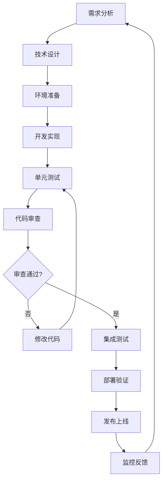

# 开发工作流程

## 📋 工作流程概述

本文档定义了 Twinkle Tools 项目的完整开发工作流程，包括需求分析、设计、开发、测试、部署等各个阶段的规范和要求。遵循这个工作流程可以确保代码质量、团队协作效率和项目进度。

---

## 🔄 开发流程图



---

## 📋 需求分析阶段

### 1. 需求收集
```markdown
## 需求文档模板

### 功能需求
- [ ] 主要功能描述
- [ ] 用户故事
- [ ] 验收标准
- [ ] 优先级

### 技术需求
- [ ] 性能要求
- [ ] 兼容性要求
- [ ] 安全要求
- [ ] 可访问性要求

### 设计要求
- [ ] UI/UX 设计
- [ ] 响应式设计
- [ ] 主题适配
- [ ] 交互规范
```

### 2. 技术可行性评估
```typescript
// 可行性评估清单
interface FeasibilityCheck {
  // 技术可行性
  technical: {
    complexity: 'low' | 'medium' | 'high';
    risks: string[];
    dependencies: string[];
    estimatedHours: number;
  };
  
  // 架构影响
  architecture: {
    requiresNewModule: boolean;
    changesToExistingModules: string[];
    impact: 'minimal' | 'moderate' | 'significant';
  };
  
  // 资源需求
  resources: {
    developers: number;
    qa: number;
    designer: boolean;
    infrastructure: boolean;
  };
}
```

---

## 🎨 技术设计阶段

### 1. 架构设计
```typescript
// 工具模块设计模板
export interface ToolDesign {
  // 基础信息
  id: string;
  name: string;
  category: ToolCategory;
  version: string;
  
  // 接口设计
  interfaces: {
    userInterface: ComponentDesign;
    apiInterface: ApiDesign;
    configInterface: ConfigDesign;
  };
  
  // 数据模型
  dataModels: DataModel[];
  
  // 依赖关系
  dependencies: {
    internal: string[];    // 内部模块依赖
    external: string[];    // 外部库依赖
  };
  
  // 实现计划
  implementation: {
    components: ComponentTask[];
    hooks: HookTask[];
    utilities: UtilityTask[];
    tests: TestTask[];
  };
}
```

### 2. 组件设计规范
```typescript
// 组件设计文档
export interface ComponentDesign {
  // 组件基本信息
  name: string;
  type: 'page' | 'layout' | 'feature' | 'ui';
  description: string;
  
  // Props 设计
  props: {
    [key: string]: {
      type: string;
      required: boolean;
      defaultValue?: any;
      description: string;
    };
  };
  
  // State 设计
  state: {
    [key: string]: {
      type: string;
      initialValue: any;
      description: string;
    };
  };
  
  // 事件设计
  events: {
    [key: string]: {
      parameters: Record<string, string>;
      description: string;
    };
  };
  
  // 样式规范
  styling: {
    variants: string[];
    responsive: string[];
    theme: string[];
  };
}
```

### 3. API 设计规范
```typescript
// API 设计文档
export interface ApiDesign {
  // 基础信息
  name: string;
  version: string;
  baseUrl: string;
  
  // 端点定义
  endpoints: {
    [path: string]: {
      method: 'GET' | 'POST' | 'PUT' | 'DELETE';
      parameters: ParameterDefinition[];
      requestBody?: RequestBodyDefinition;
      responses: ResponseDefinition[];
      authentication?: string;
    };
  };
  
  // 数据模型
  schemas: {
    [schemaName: string]: {
      type: string;
      properties: Record<string, PropertyDefinition>;
      required?: string[];
    };
  };
}
```

---

## 🛠 环境准备阶段

### 1. 开发环境设置
```bash
#!/bin/bash
# scripts/setup-dev.sh

echo "🚀 设置开发环境..."

# 1. 安装依赖
echo "📦 安装依赖..."
bun install

# 2. 环境变量配置
echo "⚙️ 配置环境变量..."
cp .env.example .env.local

# 3. 数据库初始化（如果需要）
echo "🗄️ 初始化数据库..."
bun run db:migrate

# 4. 启动开发服务
echo "🔄 启动开发服务..."
bun run dev

echo "✅ 开发环境设置完成！"
echo "🌐 访问: http://localhost:3000"
```

### 2. 工具配置
```typescript
// tools/development.ts
export interface DevToolConfig {
  // 代码检查工具
  linters: {
    eslint: boolean;
    prettier: boolean;
    typescript: boolean;
  };
  
  // 测试工具
  testing: {
    unit: boolean;
    integration: boolean;
    e2e: boolean;
    coverage: boolean;
  };
  
  // 构建工具
  building: {
    analyzer: boolean;
    bundleOptimization: boolean;
    compression: boolean;
  };
  
  // 开发服务器
  devServer: {
    port: number;
    host: string;
    hotReload: boolean;
    openBrowser: boolean;
  };
}

export const devToolConfig: DevToolConfig = {
  linters: {
    eslint: true,
    prettier: true,
    typescript: true,
  },
  testing: {
    unit: true,
    integration: true,
    e2e: true,
    coverage: true,
  },
  building: {
    analyzer: process.env.NODE_ENV === 'development',
    bundleOptimization: true,
    compression: true,
  },
  devServer: {
    port: 3000,
    host: 'localhost',
    hotReload: true,
    openBrowser: true,
  },
};
```

---

## 💻 开发实现阶段

### 1. 分支管理策略
```bash
# 分支命名规范
feature/[feature-name]        # 新功能开发
bugfix/[bug-description]      # Bug 修复
hotfix/[urgent-fix]          # 紧急修复
refactor/[refactor-desc]      # 代码重构
release/[version-number]      # 版本发布
docs/[doc-update]            # 文档更新

# 工作流程示例
git checkout -b feature/calculator-scientific-mode
git add .
git commit -m "feat(calculator): add scientific mode foundation"
git push origin feature/calculator-scientific-mode
```

### 2. 开发任务清单
```typescript
// 开发任务检查清单
export interface DevelopmentChecklist {
  // 代码实现
  implementation: {
    components: boolean;
    hooks: boolean;
    utilities: boolean;
    types: boolean;
  };
  
  // 测试编写
  testing: {
    unitTests: boolean;
    integrationTests: boolean;
    componentTests: boolean;
    e2eTests: boolean;
  };
  
  // 文档更新
  documentation: {
    apiDocs: boolean;
    componentDocs: boolean;
    userDocs: boolean;
    architectureDocs: boolean;
  };
  
  // 质量检查
  quality: {
    codeLinting: boolean;
    typeChecking: boolean;
    accessibility: boolean;
    performance: boolean;
  };
}

// 自动化检查工具
export function validateDevelopment(checklist: DevelopmentChecklist): ValidationResult {
  const results: ValidationResult = {
    passed: true,
    errors: [],
    warnings: [],
  };
  
  // 检查各项要求
  Object.entries(checklist).forEach(([category, items]) => {
    Object.entries(items).forEach(([item, complete]) => {
      if (!complete) {
        results.errors.push(`${category}.${item} 未完成`);
        results.passed = false;
      }
    });
  });
  
  return results;
}
```

### 3. 开发规范检查
```typescript
// 自动化开发检查
export class DevelopmentValidator {
  // 检查文件结构
  validateFileStructure(path: string): boolean {
    const requiredFiles = [
      'index.ts',
      'types.ts',
      'components/',
      'hooks/',
      '__tests__/',
    ];
    
    return requiredFiles.every(file => 
      fs.existsSync(pathJoin(path, file))
    );
  }
  
  // 检查类型定义
  validateTypes(modulePath: string): boolean {
    const typeFiles = glob.sync('**/*.ts', { cwd: modulePath });
    return typeFiles.length > 0;
  }
  
  // 检查测试覆盖率
  validateTestCoverage(modulePath: string): boolean {
    // 运行测试并检查覆盖率
    const coverage = runCoverage(modulePath);
    return coverage.statements >= 80;
  }
  
  // 检查代码质量
  validateCodeQuality(modulePath: string): QualityReport {
    return {
      eslint: runEslint(modulePath),
      typescript: runTypeCheck(modulePath),
      accessibility: runA11yCheck(modulePath),
      performance: runPerformanceCheck(modulePath),
    };
  }
}
```

---

## 🧪 测试阶段

### 1. 单元测试规范
```typescript
// 单元测试模板
describe('[ToolName]', () => {
  describe('核心功能', () => {
    // 基础功能测试
    it('应该正确处理基础输入', () => {
      // Given - 准备数据
      const input = '测试输入';
      
      // When - 执行操作
      const result = executeFunction(input);
      
      // Then - 验证结果
      expect(result).toBe(expectedResult);
    });
    
    // 边界条件测试
    it('应该正确处理边界条件', () => {
      expect(() => executeFunction(undefined)).not.toThrow();
    });
    
    // 错误情况测试
    it('应该正确处理错误情况', () => {
      expect(() => executeFunction(invalidInput)).toThrow();
    });
  });
  
  describe('性能要求', () => {
    it('应该在合理时间内完成', () => {
      const startTime = performance.now();
      
      executeFunction(complexInput);
      
      const endTime = performance.now();
      expect(endTime - startTime).toBeLessThan(100); // 100ms 内完成
    });
  });
});
```

### 2. 集成测试规范
```typescript
// 集成测试模板
describe('[ToolName] Integration', () => {
  let mockStorage: StorageService;
  let mockApi: ApiService;
  
  beforeEach(() => {
    mockStorage = createMockStorage();
    mockApi = createMockApi();
  });
  
  describe('用户流程测试', () => {
    it('应该完成完整的用户流程', async () => {
      // 设置工具
      const tool = createTool({
        storage: mockStorage,
        api: mockApi,
      });
      
      // 执行操作
      await tool.execute(testInput);
      
      // 验证结果
      expect(mockStorage.save).toHaveBeenCalled();
      expect(mockApi.track).toHaveBeenCalled();
    });
  });
  
  describe('模块交互测试', () => {
    it('应该正确与其他模块交互', async () => {
      const eventBus = new EventBus();
      const tool = createTool({ eventBus });
      
      // 监听事件
      const eventSpy = jest.fn();
      eventBus.on('tool:completed', eventSpy);
      
      // 触发事件
      await tool.execute(testInput);
      
      // 验证交互
      expect(eventSpy).toHaveBeenCalledWith(expectedEventData);
    });
  });
});
```

### 3. E2E 测试规范
```typescript
// E2E 测试模板
describe('[ToolName] E2E', () => {
  beforeEach(async () => {
    await page.goto('/calculator');
  });
  
  describe('用户界面测试', () => {
    it('应该正确显示工具界面', async () => {
      // 验证页面元素
      await expect(page.locator('[data-testid="tool-header"]')).toBeVisible();
      await expect(page.locator('[data-testid="tool-area"]')).toBeVisible();
      await expect(page.locator('[data-testid="tool-settings"]')).toBeVisible();
    });
    
    it('应该响应用户交互', async () => {
      // 用户操作
      await page.click('[data-testid="button-5"]');
      await page.click('[data-testid="button-3"]');
      await page.click('[data-testid="button-equals"]');
      
      // 验证结果
      await expect(page.locator('[data-testid="display"]')).toHaveValue('8');
    });
  });
  
  describe('响应式设计测试', () => {
    ['desktop', 'tablet', 'mobile'].forEach(device => {
      it(`应该在 ${device} 设备上正常显示`, async () => {
        await page.setViewportSize(viewports[device]);
        
        // 验证布局适配
        const toolArea = page.locator('[data-testid="tool-area"]');
        await expect(toolArea).toBeVisible();
        
        // 验证功能可用
        await page.click('[data-testid="button-1"]');
        await expect(toolArea.locator('[data-testid="display"]')).toHaveValue('1');
      });
    });
  });
});
```

---

## 👀 代码审查阶段

### 1. 审查检查清单
```typescript
// 代码审查检查清单
export interface CodeReviewChecklist {
  // 功能性
  functionality: {
    requirementsMet: boolean;
    edgeCasesHandled: boolean;
    errorHandling: boolean;
    businessLogicCorrect: boolean;
  };
  
  // 技术性
  technical: {
    codeStructure: boolean;
    namingConventions: boolean;
    typeSafety: boolean;
    performanceConsidered: boolean;
  };
  
  // 可维护性
  maintainability: {
    documentation: boolean;
    testCoverage: boolean;
    reusability: boolean;
    separationOfConcerns: boolean;
  };
  
  // 安全性
  security: {
    inputValidation: boolean;
    dataProtection: boolean;
    authentication: boolean;
    authorization: boolean;
  };
  
  // 可访问性
  accessibility: {
    semanticHtml: boolean;
    ariaLabels: boolean;
    keyboardNavigation: boolean;
    colorContrast: boolean;
  };
}

// 审查工具
export class CodeReviewTool {
  static async reviewPR(prNumber: number): Promise<ReviewResult> {
    const checklist = new CodeReviewChecklist();
    const result = new ReviewResult();
    
    // 自动化检查
    result.automatedChecks = await this.runAutomatedChecks(prNumber);
    
    // 人工审查检查项
    result.manualChecks = this.generateManualCheckItems(checklist);
    
    return result;
  }
  
  private static async runAutomatedChecks(prNumber: number) {
    return {
      linting: await this.runLinter(prNumber),
      testing: await this.runTests(prNumber),
      security: await this.runSecurityScan(prNumber),
      performance: await this.runPerformanceAnalysis(prNumber),
    };
  }
}
```

### 2. 审查流程规范
```markdown
## Pull Request 审查流程

### 1. 提交前检查
- [ ] 代码符合开发规范
- [ ] 所有测试通过
- [ ] 代码覆盖率达标
- [ ] 文档已更新

### 2. PR 描述模板
```markdown
## 变更类型
- [ ] 新功能 (feature)
- [ ] Bug 修复 (bugfix)
- [ ] 重构 (refactor)
- [ ] 文档更新 (docs)
- [ ] 测试 (test)

## 变更描述
简要描述本次变更的内容和原因

## 相关 Issue
关联的 Issue 编号：#123

## 测试
- [ ] 单元测试已通过
- [ ] 集成测试已通过
- [ ] 手动测试已完成

## 截图/录屏（如适用）
添加相关的截图或操作录屏

## 部署检查
- [ ] 开发环境测试通过
- [ ] 预发布环境测试通过
```

### 3. 审查要点
- **功能正确性**: 代码是否实现了预期功能
- **代码质量**: 代码是否清晰、可读、可维护
- **性能影响**: 是否有性能问题
- **安全性**: 是否存在安全隐患
- **测试覆盖**: 测试是否充分
- **文档完整性**: 文档是否更新
```

---

## 🚀 部署验证阶段

### 1. 部署检查清单
```typescript
// 部署检查清单
export interface DeploymentChecklist {
  // 构建检查
  build: {
    typescriptCompilation: boolean;
    bundleSizeOptimization: boolean;
    assetOptimization: boolean;
    codeSplitting: boolean;
  };
  
  // 环境配置
  environment: {
    productionConfig: boolean;
    apiEndpoints: boolean;
    secretsManagement: boolean;
    monitoringSetup: boolean;
  };
  
  // 功能验证
  functionality: {
    coreFeatures: boolean;
    newFeatures: boolean;
    existingFeatures: boolean;
    edgeCases: boolean;
  };
  
  // 性能验证
  performance: {
    loadTime: boolean;
    firstContentfulPaint: boolean;
    largestContentfulPaint: boolean;
    cumulativeLayoutShift: boolean;
  };
  
  // 安全检查
  security: {
    sslCertificate: boolean;
    securityHeaders: boolean;
    inputValidation: boolean;
    dataProtection: boolean;
  };
}
```

### 2. 自动化部署流水线
```yaml
# .github/workflows/deploy.yml
name: Deploy to Production

on:
  push:
    branches: [main]

jobs:
  test:
    runs-on: ubuntu-latest
    steps:
      - name: Checkout code
        uses: actions/checkout@v4
        
      - name: Setup Node.js
        uses: actions/setup-node@v4
        with:
          node-version: '18'
          
      - name: Install dependencies
        run: bun install
        
      - name: Run tests
        run: bun run test:coverage
        
      - name: Run linting
        run: bun run lint
        
      - name: Type checking
        run: bun run type-check

  build:
    needs: test
    runs-on: ubuntu-latest
    steps:
      - name: Build application
        run: bun run build
        
      - name: Optimize bundle
        run: bun run analyze
        
      - name: Run E2E tests
        run: bun run test:e2e

  deploy:
    needs: build
    runs-on: ubuntu-latest
    steps:
      - name: Deploy to Vercel
        uses: amondnet/vercel-action@v25
        with:
          vercel-token: ${{ secrets.VERCEL_TOKEN }}
          vercel-org-id: ${{ secrets.ORG_ID }}
          vercel-project-id: ${{ secrets.PROJECT_ID }}
          vercel-args: '--prod'
          
      - name: Run health checks
        run: bun run health-check
        
      - name: Notify deployment
        uses: 8398a7/action-slack@v3
        with:
          status: ${{ job.status }}
          channel: '#deployments'
          webhook_url: ${{ secrets.SLACK_WEBHOOK }}
```

---

## 📊 监控反馈阶段

### 1. 性能监控
```typescript
// 性能监控系统
export class PerformanceMonitor {
  private metrics: Map<string, number> = new Map();
  
  // 监控关键指标
  trackMetric(name: string, value: number): void {
    this.metrics.set(name, value);
    
    // 发送到监控服务
    this.sendToMonitoring(name, value);
  }
  
  // 监控用户行为
  trackUserAction(action: string, context?: any): void {
    const metric = {
      action,
      timestamp: Date.now(),
      context,
      userAgent: navigator.userAgent,
      url: window.location.href,
    };
    
    this.sendToAnalytics('user_action', metric);
  }
  
  // 监控错误
  trackError(error: Error, context?: any): void {
    const errorReport = {
      message: error.message,
      stack: error.stack,
      context,
      timestamp: Date.now(),
      userAgent: navigator.userAgent,
      url: window.location.href,
    };
    
    this.sendToAnalytics('error', errorReport);
  }
  
  private sendToMonitoring(name: string, value: number): void {
    // 发送到监控服务（如 New Relic, DataDog）
    if (typeof gtag !== 'undefined') {
      gtag('event', name, {
        event_category: 'Performance',
        value: Math.round(value),
        non_interaction: true,
      });
    }
  }
  
  private sendToAnalytics(type: string, data: any): void {
    // 发送到分析服务
    console.log(`[Analytics] ${type}:`, data);
  }
}
```

### 2. 用户反馈收集
```typescript
// 用户反馈系统
export class FeedbackManager {
  // 收集用户反馈
  submitFeedback(feedback: UserFeedback): Promise<void> {
    return fetch('/api/feedback', {
      method: 'POST',
      headers: {
        'Content-Type': 'application/json',
      },
      body: JSON.stringify({
        ...feedback,
        timestamp: Date.now(),
        version: process.env.NEXT_PUBLIC_APP_VERSION,
      }),
    });
  }
  
  // 收集使用统计
  trackUsage(feature: string, action: string): void {
    this.submitFeedback({
      type: 'usage',
      data: {
        feature,
        action,
        timestamp: Date.now(),
      },
    });
  }
  
  // 收集性能反馈
  trackPerformance(metircs: PerformanceMetrics): void {
    this.submitFeedback({
      type: 'performance',
      data: metircs,
    });
  }
}
```

### 3. 持续改进
```typescript
// 改进建议系统
export class ImprovementSystem {
  // 分析用户反馈
  analyzeFeedback(feedback: UserFeedback[]): ImprovementSuggestions {
    const suggestions: ImprovementSuggestions = {
      features: [],
      improvements: [],
      fixes: [],
    };
    
    // 分析功能需求
    const featureRequests = feedback
      .filter(f => f.type === 'feature-request')
      .map(f => f.data);
    
    suggestions.features = this.aggregateFeatureRequests(featureRequests);
    
    // 分析改进建议
    const improvements = feedback
      .filter(f => f.type === 'improvement')
      .map(f => f.data);
    
    suggestions.improvements = this.aggregateImprovements(improvements);
    
    // 分析问题报告
    const bugs = feedback
      .filter(f => f.type === 'bug')
      .map(f => f.data);
    
    suggestions.fixes = this.aggregateBugs(bugs);
    
    return suggestions;
  }
  
  // 优先级排序
  prioritizeSuggestions(suggestions: ImprovementSuggestions): PrioritizedSuggestions {
    // 根据影响范围、用户数量、实现复杂度等排序
    return this.rankByPriority(suggestions);
  }
}
```

---

## 📈 流程优化

### 1. 自动化工具
```typescript
// 自动化工具集成
export class WorkflowAutomation {
  // 自动化开发检查
  static async runDevChecks(): Promise<void> {
    console.log('🔍 运行开发检查...');
    
    // 代码格式检查
    await this.runPrettier();
    
    // 类型检查
    await this.runTypeCheck();
    
    // 测试运行
    await this.runTests();
    
    // 构建检查
    await this.runBuildCheck();
    
    console.log('✅ 所有检查通过！');
  }
  
  // 自动化提交准备
  static async prepareCommit(): Promise<void> {
    console.log('📝 准备提交...');
    
    // 生成提交信息
    const commitMessage = await this.generateCommitMessage();
    
    // 运行预提交钩子
    await this.runPreCommitHooks();
    
    console.log(`💡 建议提交信息: ${commitMessage}`);
  }
  
  // 自动化 PR 创建
  static async createPR(title: string, body: string): Promise<void> {
    console.log('🚀 创建 Pull Request...');
    
    // 检查分支状态
    await this.checkBranchStatus();
    
    // 运行完整测试
    await this.runFullTests();
    
    // 创建 PR
    const pr = await this.createGitHubPR(title, body);
    
    // 添加审查者
    await this.addReviewers(pr.number);
    
    console.log(`✅ PR 创建成功: ${pr.html_url}`);
  }
}
```

### 2. 质量门禁
```typescript
// 质量门禁系统
export class QualityGates {
  private static standards = {
    testCoverage: 80,
    codeQuality: 8.0,
    performanceScore: 90,
    securityScore: 95,
  };
  
  // 检查是否可以通过质量门禁
  static async canProceed(commitHash: string): Promise<QualityGateResult> {
    const results = await Promise.all([
      this.checkTestCoverage(commitHash),
      this.checkCodeQuality(commitHash),
      this.checkPerformance(commitHash),
      this.checkSecurity(commitHash),
    ]);
    
    const overallScore = results.reduce((sum, r) => sum + r.score, 0) / results.length;
    
    return {
      passed: overallScore >= this.standards.codeQuality,
      score: overallScore,
      details: results,
      recommendations: this.generateRecommendations(results),
    };
  }
  
  // 检查测试覆盖率
  private static async checkTestCoverage(commitHash: string): Promise<QualityCheckResult> {
    const coverage = await this.getTestCoverage(commitHash);
    return {
      metric: 'test-coverage',
      score: coverage,
      passed: coverage >= this.standards.testCoverage,
      threshold: this.standards.testCoverage,
    };
  }
  
  // 生成改进建议
  private static generateRecommendations(results: QualityCheckResult[]): string[] {
    const recommendations: string[] = [];
    
    results.forEach(result => {
      if (!result.passed) {
        switch (result.metric) {
          case 'test-coverage':
            recommendations.push('增加单元测试覆盖率，目标达到 80%');
            break;
          case 'code-quality':
            recommendations.push('重构复杂代码，改善代码可读性');
            break;
          case 'performance':
            recommendations.push('优化性能瓶颈，减少加载时间');
            break;
          case 'security':
            recommendations.push('修复安全漏洞，加强输入验证');
            break;
        }
      }
    });
    
    return recommendations;
  }
}
```

---

通过遵循这个完整的开发工作流程，Twinkle Tools 项目可以确保高质量的代码交付、高效的团队协作和持续的改进优化。每个阶段都有明确的规范和自动化工具支持，大大提高了开发效率和产品质量。