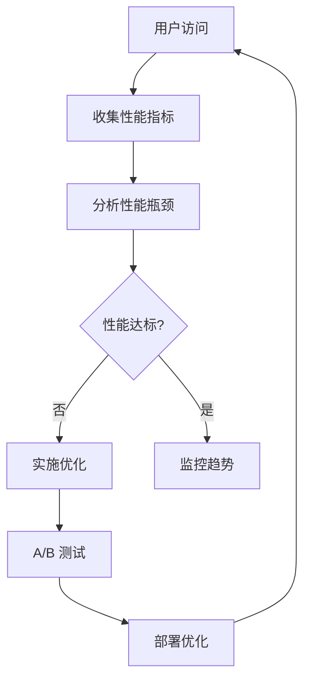

# 性能优化指南

## 📋 性能优化概述

Twinkle Tools 作为一个现代 Web 应用，性能优化是确保用户体验的关键。本文档涵盖了从构建时到运行时的全方位性能优化策略和最佳实践。

### 性能目标
- **FCP (First Contentful Paint)**: < 1.5秒
- **LCP (Largest Contentful Paint)**: < 2.5秒
- **FID (First Input Delay)**: < 100ms
- **CLS (Cumulative Layout Shift)**: < 0.1
- **TTI (Time to Interactive)**: < 3.8秒

---

## ⚡ 构建时优化

### 1. 代码分割策略

#### 路由级代码分割
```typescript
// next.config.ts
const nextConfig: NextConfig = {
  experimental: {
    optimizePackageImports: ['lucide-react', '@radix-ui/react-icons'],
  },
  
  // 启用模块级代码分割
  webpack: (config, { isServer }) => {
    if (!isServer) {
      config.optimization.splitChunks = {
        chunks: 'all',
        cacheGroups: {
          vendor: {
            test: /[\\/]node_modules[\\/]/,
            name: 'vendors',
            chunks: 'all',
          },
          common: {
            name: 'common',
            minChunks: 2,
            chunks: 'all',
            enforce: true,
          },
        },
      };
    }
    return config;
  },
};

// 动态导入页面组件
const Calculator = dynamic(() => import('@/app/calculator/page'), {
  loading: () => <div>加载中...</div>,
  ssr: false, // 客户端渲染重型组件
});
```

#### 组件级懒加载
```typescript
// components/tools/index.ts
export const CalculatorTool = lazy(() => import('./Calculator'));
export const ColorPickerTool = lazy(() => import('./ColorPicker'));
export const PasswordGeneratorTool = lazy(() => import('./PasswordGenerator'));

// 使用场景
export function ToolRouter({ toolName }: { toolName: string }) {
  const ToolComponent = useMemo(() => {
    switch (toolName) {
      case 'calculator':
        return CalculatorTool;
      case 'color-picker':
        return ColorPickerTool;
      case 'password-generator':
        return PasswordGeneratorTool;
      default:
        return null;
    }
  }, [toolName]);

  return (
    <Suspense fallback={<ToolLoading />}>
      {ToolComponent && <ToolComponent />}
    </Suspense>
  );
}
```

### 2. 包大小优化

#### Tree Shaking 配置
```typescript
// package.json - 确保支持 tree shaking
{
  "sideEffects": [
    "*.css",
    "*.scss",
    "*.less",
    "./dist/index.js"
  ],
  "exports": {
    ".": {
      "import": "./dist/index.esm.js",
      "require": "./dist/index.js",
      "types": "./dist/index.d.ts"
    }
  }
}

// 优化图标导入
import { Calculator, Palette, FileText } from 'lucide-react';

// 而不是
import * as Icons from 'lucide-react';
const Calculator = Icons.Calculator;
```

#### 依赖分析
```bash
# 分析包大小
bunx webpack-bundle-analyzer .next/static/chunks/

# 查找大体积依赖
du -sh node_modules/* | sort -hr | head -20
```

### 3. 图片优化

#### Next.js Image 配置
```typescript
// next.config.ts
const nextConfig: NextConfig = {
  images: {
    formats: ['image/webp', 'image/avif'],
    deviceSizes: [640, 750, 828, 1080, 1200, 1920, 2048],
    imageSizes: [16, 32, 48, 64, 96, 128, 256, 384],
    minimumCacheTTL: 60 * 60 * 24 * 365, // 1年
    dangerouslyAllowSVG: true,
    contentSecurityPolicy: "default-src 'self'; script-src 'none'; sandbox;",
  },
};

// 使用示例
import Image from 'next/image';

export function ToolIcon({ src, alt, size = 24 }: { src: string; alt: string; size?: number }) {
  return (
    <Image
      src={src}
      alt={alt}
      width={size}
      height={size}
      priority={size < 50} // 小图标优先加载
      className="rounded"
    />
  );
}
```

---

## 🚀 运行时优化

### 1. React 性能优化

#### Memoization 策略
```typescript
// 使用 React.memo 优化组件
const CalculatorButton = React.memo<{ 
  onClick: () => void; 
  children: React.ReactNode;
  variant?: 'primary' | 'secondary';
}>(({ onClick, children, variant = 'primary' }) => {
  return (
    <Button onClick={onClick} variant={variant}>
      {children}
    </Button>
  );
});

// 使用 useMemo 缓存计算结果
export function ColorConverter({ hex }: { hex: string }) {
  const colorFormats = useMemo(() => {
    return convertColorFormats(hex);
  }, [hex]);

  return (
    <div>
      {Object.entries(colorFormats).map(([format, value]) => (
        <div key={format}>
          <strong>{format}:</strong> {JSON.stringify(value)}
        </div>
      ))}
    </div>
  );
}

// 使用 useCallback 缓存函数
export function Calculator({ onResult }: { onResult: (result: number) => void }) {
  const [value, setValue] = useState('0');

  const handleCalculate = useCallback(() => {
    const result = evaluateExpression(value);
    onResult(result);
  }, [value, onResult]);

  return (
    <div>
      {/* 计算器 UI */}
      <button onClick={handleCalculate}>计算</button>
    </div>
  );
}
```

#### 虚拟化长列表
```typescript
// 使用 react-window 处理长列表
import { FixedSizeList as List } from 'react-window';

export function HistoryList({ items }: { items: HistoryItem[] }) {
  const Row = ({ index, style }: { index: number; style: React.CSSProperties }) => (
    <div style={style} className="border-b p-2">
      {items[index].expression} = {items[index].result}
    </div>
  );

  return (
    <div className="h-96 w-full">
      <List
        height={384}
        itemCount={items.length}
        itemSize={50}
        itemData={items}
      >
        {Row}
      </List>
    </div>
  );
}
```

### 2. 状态管理优化

#### 减少不必要的重渲染
```typescript
// ✅ 推荐：使用状态拆分
export function Calculator() {
  const [display, setDisplay] = useState('0');
  const [previousValue, setPreviousValue] = useState<number | null>(null);
  const [operation, setOperation] = useState<string | null>(null);
  
  // 而不是将所有状态放在一个对象中
  // const [state, setState] = useState({
  //   display: '0',
  //   previousValue: null,
  //   operation: null,
  // });
}

// ✅ 推荐：使用 Context 进行状态隔离
const CalculatorContext = createContext<{
  state: CalculatorState;
  dispatch: React.Dispatch<CalculatorAction>;
} | null>(null);

export function CalculatorProvider({ children }: { children: React.ReactNode }) {
  const [state, dispatch] = useReducer(calculatorReducer, initialState);
  
  return (
    <CalculatorContext.Provider value={{ state, dispatch }}>
      {children}
    </CalculatorContext.Provider>
  );
}
```

#### 防抖和节流
```typescript
// 自定义防抖 Hook
export function useDebounce<T>(value: T, delay: number): T {
  const [debouncedValue, setDebouncedValue] = useState<T>(value);

  useEffect(() => {
    const handler = setTimeout(() => {
      setDebouncedValue(value);
    }, delay);

    return () => {
      clearTimeout(handler);
    };
  }, [value, delay]);

  return debouncedValue;
}

// 使用示例
export function SearchInput({ onSearch }: { onSearch: (query: string) => void }) {
  const [query, setQuery] = useState('');
  const debouncedQuery = useDebounce(query, 300);

  useEffect(() => {
    if (debouncedQuery) {
      onSearch(debouncedQuery);
    }
  }, [debouncedQuery, onSearch]);

  return (
    <Input
      value={query}
      onChange={(e) => setQuery(e.target.value)}
      placeholder="搜索工具..."
    />
  );
}
```

---

## 🎨 渲染优化

### 1. 关键渲染路径

#### 关键 CSS 内联
```typescript
// app/layout.tsx
export default function RootLayout({
  children,
}: {
  children: React.ReactNode;
}) {
  return (
    <html lang="zh-CN">
      <head>
        {/* 关键 CSS 内联 */}
        <style
          dangerouslySetInnerHTML={{
            __html: `
              body { margin: 0; font-family: system-ui; }
              .loading { display: flex; justify-content: center; align-items: center; height: 100vh; }
            `,
          }}
        />
      </head>
      <body>
        {children}
      </body>
    </html>
  );
}
```

#### 预加载关键资源
```typescript
// app/layout.tsx
export const metadata: Metadata = {
  // 预加载字体
  preload: [
    {
      url: '/fonts/geist-sans-regular.woff2',
      as: 'font',
      type: 'font/woff2',
      crossOrigin: 'anonymous',
    },
  ],
  
  // 预连接到外部域名
  preconnect: ['https://fonts.googleapis.com'],
  
  // DNS 预取
  dnsPrefetch: ['https://api.example.com'],
};
```

### 2. CSS 优化

#### 关键 CSS 提取
```css
/* globals.css - 关键 CSS */
@layer critical {
  /* 首屏关键样式 */
  .container { max-width: 1200px; margin: 0 auto; padding: 0 16px; }
  .btn { padding: 8px 16px; border: none; border-radius: 4px; cursor: pointer; }
  .btn-primary { background: #3b82f6; color: white; }
}

@layer components {
  /* 非关键样式 */
  .card { box-shadow: 0 1px 3px rgba(0, 0, 0, 0.1); }
  .card:hover { box-shadow: 0 4px 6px rgba(0, 0, 0, 0.1); }
}
```

#### CSS 容器查询
```css
/* 响应式组件 */
.tool-card {
  container-type: inline-size;
}

@container (min-width: 400px) {
  .tool-card__title {
    font-size: 1.25rem;
  }
}
```

---

## 📱 用户体验优化

### 1. 加载状态管理

#### 骨架屏设计
```typescript
// components/Skeleton.tsx
export function ToolCardSkeleton() {
  return (
    <Card className="animate-pulse">
      <CardHeader className="pb-3">
        <div className="flex items-center justify-between mb-2">
          <div className="h-8 w-8 bg-gray-200 rounded-lg"></div>
          <div className="h-5 w-16 bg-gray-200 rounded"></div>
        </div>
        <div className="h-6 w-24 bg-gray-200 rounded"></div>
      </CardHeader>
      <CardContent>
        <div className="space-y-2">
          <div className="h-4 bg-gray-200 rounded"></div>
          <div className="h-4 bg-gray-200 rounded w-3/4"></div>
        </div>
      </CardContent>
    </Card>
  );
}

// 使用示例
export function ToolsGrid({ loading, tools }: { loading: boolean; tools: Tool[] }) {
  if (loading) {
    return (
      <div className="grid grid-cols-1 md:grid-cols-2 lg:grid-cols-3 xl:grid-cols-4 gap-6">
        {Array.from({ length: 12 }).map((_, i) => (
          <ToolCardSkeleton key={i} />
        ))}
      </div>
    );
  }

  return (
    <div className="grid grid-cols-1 md:grid-cols-2 lg:grid-cols-3 xl:grid-cols-4 gap-6">
      {tools.map((tool) => (
        <ToolCard key={tool.id} tool={tool} />
      ))}
    </div>
  );
}
```

#### 渐进式加载
```typescript
// 使用 Intersection Observer 实现懒加载
export function InfiniteToolList() {
  const [tools, setTools] = useState<Tool[]>([]);
  const [loading, setLoading] = useState(false);
  const [page, setPage] = useState(1);
  const observerRef = useRef<HTMLDivElement>(null);

  useEffect(() => {
    const observer = new IntersectionObserver(
      ([entry]) => {
        if (entry.isIntersecting && !loading) {
          loadMoreTools();
        }
      },
      { threshold: 1.0 }
    );

    if (observerRef.current) {
      observer.observe(observerRef.current);
    }

    return () => observer.disconnect();
  }, [loading, page]);

  const loadMoreTools = async () => {
    setLoading(true);
    const newTools = await fetchTools(page);
    setTools(prev => [...prev, ...newTools]);
    setPage(prev => prev + 1);
    setLoading(false);
  };

  return (
    <div>
      <div className="grid grid-cols-1 md:grid-cols-2 lg:grid-cols-3 gap-6">
        {tools.map((tool) => (
          <ToolCard key={tool.id} tool={tool} />
        ))}
      </div>
      
      {loading && <div className="text-center py-8">加载中...</div>}
      <div ref={observerRef} className="h-10" />
    </div>
  );
}
```

### 2. 交互优化

#### 输入优化
```typescript
// 防抖输入组件
export function OptimizedInput({ 
  value, 
  onChange, 
  delay = 300 
}: {
  value: string;
  onChange: (value: string) => void;
  delay?: number;
}) {
  const [inputValue, setInputValue] = useState(value);
  const debouncedOnChange = useDebounce(onChange, delay);

  useEffect(() => {
    setInputValue(value);
  }, [value]);

  const handleChange = (e: React.ChangeEvent<HTMLInputElement>) => {
    const newValue = e.target.value;
    setInputValue(newValue);
    debouncedOnChange(newValue);
  };

  return (
    <Input
      value={inputValue}
      onChange={handleChange}
      placeholder="输入内容..."
    />
  );
}
```

#### Web Workers 处理重型计算
```typescript
// workers/calculator.worker.ts
self.onmessage = function(e) {
  const { expression } = e.data;
  
  try {
    // 重型计算在 Worker 中执行
    const result = evaluateExpression(expression);
    self.postMessage({ result, error: null });
  } catch (error) {
    self.postMessage({ result: null, error: error.message });
  }
};

// 主线程使用
export function AdvancedCalculator() {
  const workerRef = useRef<Worker>();

  useEffect(() => {
    workerRef.current = new Worker('/workers/calculator.worker.js');
    
    return () => {
      workerRef.current?.terminate();
    };
  }, []);

  const calculate = (expression: string) => {
    return new Promise<number>((resolve, reject) => {
      workerRef.current!.onmessage = (e) => {
        if (e.data.error) {
          reject(new Error(e.data.error));
        } else {
          resolve(e.data.result);
        }
      };
      
      workerRef.current!.postMessage({ expression });
    });
  };

  return (
    <div>
      {/* 计算器 UI */}
    </div>
  );
}
```

---

## 🔍 性能监控

### 1. Web Vitals 监控

```typescript
// lib/web-vitals.ts
import { getCLS, getFID, getFCP, getLCP, getTTFB } from 'web-vitals';

function sendToAnalytics(metric: any) {
  // 发送到分析服务
  if (process.env.NODE_ENV === 'production') {
    gtag('event', metric.name, {
      event_category: 'Web Vitals',
      event_label: metric.id,
      value: Math.round(metric.name === 'CLS' ? metric.value * 1000 : metric.value),
      non_interaction: true,
    });
  }
}

export function reportWebVitals() {
  getCLS(sendToAnalytics);
  getFID(sendToAnalytics);
  getFCP(sendToAnalytics);
  getLCP(sendToAnalytics);
  getTTFB(sendToAnalytics);
}
```

### 2. 自定义性能指标

```typescript
// lib/performance-monitor.ts
export class PerformanceMonitor {
  static measureToolLoad(toolName: string, fn: () => Promise<void>) {
    return async () => {
      const startMark = `${toolName}-start`;
      const endMark = `${toolName}-end`;
      
      performance.mark(startMark);
      
      try {
        await fn();
      } finally {
        performance.mark(endMark);
        performance.measure(toolName, startMark, endMark);
        
        const measure = performance.getEntriesByName(toolName)[0];
        console.log(`${toolName} 加载时间: ${measure.duration}ms`);
        
        // 发送分析数据
        if (process.env.NODE_ENV === 'production') {
          gtag('event', 'tool_load_time', {
            event_category: 'Performance',
            event_label: toolName,
            value: Math.round(measure.duration),
          });
        }
      }
    };
  }

  static trackUserInteraction(action: string, tool: string) {
    gtag('event', 'user_interaction', {
      event_category: 'Engagement',
      event_label: `${tool}_${action}`,
    });
  }
}
```

### 3. 性能预算设置

```typescript
// next.config.ts
const nextConfig: NextConfig = {
  webpack: (config, { isServer }) => {
    if (!isServer) {
      config.optimization.splitChunks = {
        chunks: 'all',
        cacheGroups: {
          commons: {
            name: 'commons',
            chunks: 'all',
            minChunks: 2,
            enforce: true,
          },
          vendor: {
            test: /[\\/]node_modules[\\/]/,
            name: 'vendor',
            chunks: 'all',
            priority: 10,
          },
        },
      };
    }
    return config;
  },
};

// package.json scripts
{
  "scripts": {
    "analyze": "ANALYZE=true bun run build",
    "lighthouse": "bunx lighthouse http://localhost:3000 --output html --output-path ./lighthouse-report.html",
    "bundle-size": "bunx bundlesize",
    "performance-budget": "bunx webpack-bundle-analyzer .next/static/chunks/"
  }
}
```

---

## 🔧 缓存策略

### 1. 浏览器缓存

#### 静态资源缓存
```typescript
// next.config.ts
const nextConfig: NextConfig = {
  async headers() {
    return [
      {
        source: '/_next/static/(.*)',
        headers: [
          {
            key: 'Cache-Control',
            value: 'public, max-age=31536000, immutable',
          },
        ],
      },
      {
        source: '/fonts/(.*)',
        headers: [
          {
            key: 'Cache-Control',
            value: 'public, max-age=31536000, immutable',
          },
        ],
      },
      {
        source: '/images/(.*)',
        headers: [
          {
            key: 'Cache-Control',
            value: 'public, max-age=86400, must-revalidate',
          },
        ],
      },
    ];
  },
};
```

### 2. Service Worker 缓存

```typescript
// public/sw.js
const CACHE_NAME = 'twinkle-tools-v1';
const STATIC_CACHE = 'static-v1';
const DYNAMIC_CACHE = 'dynamic-v1';

const STATIC_ASSETS = [
  '/',
  '/manifest.json',
  // 关键静态资源
];

self.addEventListener('install', (event) => {
  event.waitUntil(
    caches.open(STATIC_CACHE)
      .then(cache => cache.addAll(STATIC_ASSETS))
  );
});

self.addEventListener('fetch', (event) => {
  const { request } = event;
  
  if (request.destination === 'image') {
    event.respondWith(
      caches.match(request).then(response => {
        return response || fetch(request).then(fetchResponse => {
          return caches.open(DYNAMIC_CACHE).then(cache => {
            cache.put(request, fetchResponse.clone());
            return fetchResponse;
          });
        });
      })
    );
  } else {
    event.respondWith(
      fetch(request).catch(() => caches.match(request))
    );
  }
});
```

---

## 📊 性能测试

### 1. 自动化性能测试

```typescript
// __tests__/performance/calculator.test.ts
import { render, screen, waitFor } from '@testing-library/react';
import { Calculator } from '@/components/Calculator';

describe('Calculator Performance', () => {
  it('应该在 100ms 内渲染完成', async () => {
    const startTime = performance.now();
    
    render(<Calculator />);
    
    await waitFor(() => {
      expect(screen.getByDisplayValue('0')).toBeInTheDocument();
    });
    
    const endTime = performance.now();
    expect(endTime - startTime).toBeLessThan(100);
  });

  it('应该快速处理大量计算', () => {
    const { result } = renderHook(() => useCalculator());
    
    const startTime = performance.now();
    
    for (let i = 0; i < 1000; i++) {
      result.current.inputNumber('9');
    }
    
    const endTime = performance.now();
    expect(endTime - startTime).toBeLessThan(50);
  });
});
```

### 2. Lighthouse 集成

```bash
# lighthouse.config.js
module.exports = {
  ci: {
    collect: {
      url: ['http://localhost:3000'],
      numberOfRuns: 3,
    },
    assert: {
      assertions: {
        'categories:performance': ['warn', { minScore: 0.9 }],
        'categories:accessibility': ['error', { minScore: 0.9 }],
        'categories:best-practices': ['warn', { minScore: 0.9 }],
        'categories:seo': ['warn', { minScore: 0.9 }],
      },
    },
    upload: {
      target: 'temporary-public-storage',
    },
  },
};
```

---

## 🔄 持续优化

### 1. 性能监控流程



### 2. 优化检查清单

#### 代码层面
- [ ] 移除未使用的代码和依赖
- [ ] 实施代码分割和懒加载
- [ ] 优化图片和媒体文件
- [ ] 使用高效的算法和数据结构
- [ ] 实施适当的缓存策略

#### 构建层面
- [ ] 启用 Gzip/Brotli 压缩
- [ ] 优化 Webpack 配置
- [ ] 实施树摇优化
- [ ] 配置 CDN 加速
- [ ] 设置适当的缓存头

#### 用户体验层面
- [ ] 实现骨架屏和加载状态
- [ ] 优化关键渲染路径
- [ ] 减少布局偏移
- [ ] 优化输入响应性
- [ ] 实施渐进式增强

---

通过实施这些性能优化策略，Twinkle Tools 能够为用户提供快速、流畅的使用体验，同时保持良好的性能指标和用户满意度。